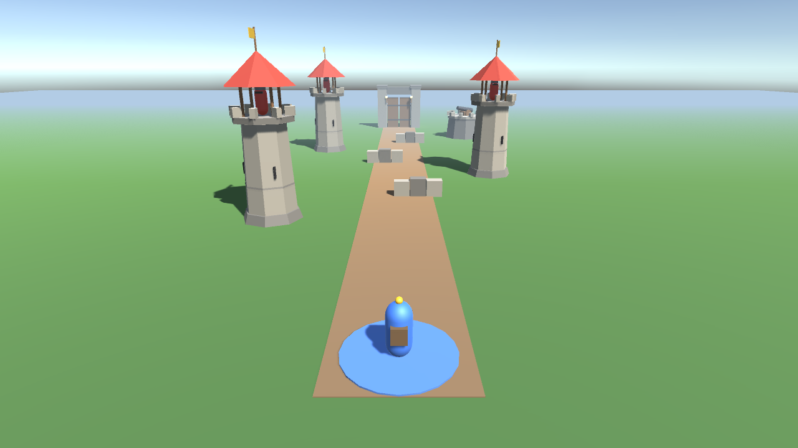

# Gauntlet (C#, Unity)

Run the gauntlet: walk the path from the blue start pad to the gate while towers shoot at you. Take cover behind the
stone walls, survive the archers and the heavy cannon, and reach the gate.

The long-term idea is a stream game: viewers' chat commands spawn enemies or help the player (a new weapon, more armor).



## What it practises
Every gameplay class is written by hand, step by step:
- **Composition over inheritance**: behaviours (movement, weapons) as interfaces a character HAS, swappable at runtime;
  a few features built with inheritance on purpose, to compare.
- **SOLID, design patterns** (Strategy, Observer, Object Pool for arrows...).
- **Algorithms as real mechanics**: e.g. cooldown scheduling for towers (Task Scheduler), a sliding window that lets
  towers punish a player who repeats the same move, a spatial grid for fast hit checks.

## Layout
```
Assets/Scripts/          the game code (hand-written)
Assets/Scenes/           Gauntlet.unity
Assets/Prefabs/Visuals/  look-only prefabs: PlayerBody, TowerSoldierBody, Arrow, Fire (no scripts)
Assets/Art/              models (FBX) + materials
Assets/Editor/           GauntletSceneBuilder: rebuilds the art scene (menu: Gauntlet > Rebuild Scene)
Art-Source/              Blender sources + the script that generates the models
bin/play                 build + run without opening Unity
ROADMAP.md               the plan: what comes next, step by step
Docs/                    algorithms-in-the-real-world.html: NeetCode 150 → games, software, beyond; ideas for this game
```

## Run (no Unity window needed)
```
bin/play
```
or in VS Code: **Cmd+Shift+B** (the "Play Gauntlet" task). It rebuilds the scene, attaches your `Game` class (the
composition root: a `public class Game : MonoBehaviour` in `Assets/Scripts`), builds `Builds/Gauntlet.app` with Unity in
batch mode (~1 min the first time, faster after), launches it, and streams your `Debug.Log` lines into the terminal.
Compile errors are printed as `file(line,col)  CSxxxx  message`. Close the Unity editor first if it has the project open.

Or the classic way: open the folder in Unity 6 (6000.4), open `Assets/Scenes/Gauntlet.unity`, press Play.
Editor setup (VS Code): [../UNITY-VSCODE-SETUP.md](../UNITY-VSCODE-SETUP.md).
