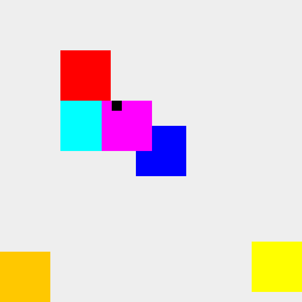

# Battlefield (Java, Swing)

A tiny top-down game: you move the blue square with the arrow keys, enemies act on their own every tick.



- **Red bouncer**: walks left and right, turning at the edges.
- **Yellow chaser**: walks toward you, closing the bigger gap first, and stops exactly on you.
- **Cyan gun bouncer**: bounces, and fires bullets toward you when you are on its row.
- **Magenta gun chaser**: walks toward you like the chaser, and fires when you are on its row.
- **Orange artillery**: stands still and fires once its crew has finished a job list with a cooldown between
  jobs of the same type. Check its scheduling on its own with `java -cp out ArtillerySoldier`.

The **Next map** button under the battlefield switches between two maps: map 1 has every soldier, map 2 has the
gun chaser alone.

## What it practises
- **Encapsulation**: a `Soldier` moves itself and keeps itself inside the map (clamping); callers only give a direction.
- **Inheritance + polymorphism**: `BouncerSoldier`, `ChaserSoldier` and `GunBouncerSoldier` override `update()`;
  the game loop calls `s.update(...)` on every soldier without knowing its type.
- **A game loop**: a Swing `Timer` with a lambda calls `tick()` every 100 ms; `repaint()` asks Swing to redraw.
- **Ownership**: a bullet is not a soldier. Soldiers decide and create bullets; the game owns the bullet list, moves,
  draws and removes them (`removeIf`). Bullets carry their own direction vector `{dx, dy}`.
- **An algorithm inside a game object**: `ArtillerySoldier` plans its job list with a max-heap (jobs that are free now)
  and a FIFO queue (jobs that are cooling down), the classic Task Scheduler problem.
- **Next**: the gun chaser repeats code from two classes, which shows where inheritance stops scaling; then the same
  game with composition.

## Run
```
javac -d out *.java && java -cp out Simplest
```
Requires a JDK (17+). `backups/Battlefield.java` is the original one-file starter, kept for comparison.
